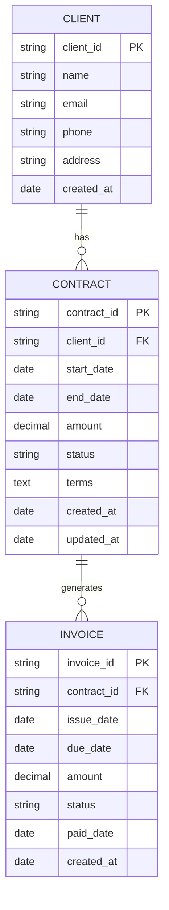
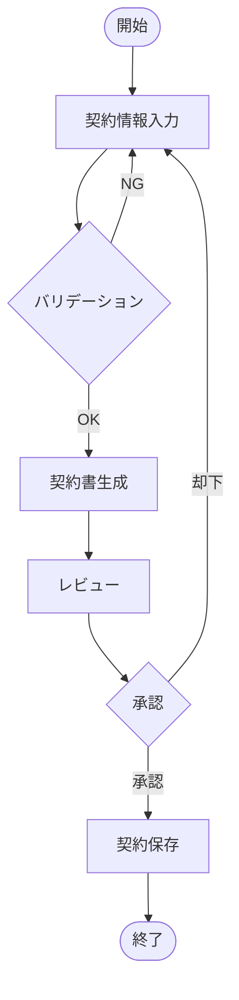

# ダイアグラム

このディレクトリには、プロジェクトに関連する各種図を格納します。

## 格納する図の種類

### 1. ER図（Entity-Relationship Diagram）
データベース設計を示すER図を格納します。

- `er-diagram.png` - メインのER図
- `er-diagram.mmd` - Mermaid形式のソースファイル

### 2. ワイヤーフレーム
UIデザインのワイヤーフレームを格納します。

- `wireframe-dashboard.png` - ダッシュボード画面
- `wireframe-contract-list.png` - 契約一覧画面
- `wireframe-contract-form.png` - 契約入力フォーム
- `wireframe-invoice-list.png` - 請求書一覧画面

### 3. フロー図
業務フローやシステムフローを格納します。

- `flow-contract-creation.png` - 契約作成フロー
- `flow-invoice-generation.png` - 請求書生成フロー
- `flow-approval-process.png` - 承認プロセスフロー

### 4. アーキテクチャ図
システムアーキテクチャを示す図を格納します。

- `architecture-overview.png` - システム全体のアーキテクチャ
- `architecture-deployment.png` - デプロイメント構成図

## ファイル命名規則

- ファイル名は英数字とハイフンを使用
- 小文字で統一
- 拡張子: `.png`, `.jpg`, `.svg`, `.mmd` (Mermaid), `.drawio` (Draw.io)

## ツール

以下のツールを使用して図を作成できます：

- [Mermaid](https://mermaid.js.org/) - Markdown形式で図を記述
- [Draw.io](https://app.diagrams.net/) - オンライン作図ツール
- [PlantUML](https://plantuml.com/) - テキストベースのUMLツール
- [Figma](https://www.figma.com/) - UIデザインツール

## サンプル

### Mermaid形式のER図サンプル

### フロー図サンプル

## 更新履歴

図を更新した場合は、以下の情報を記録してください：

- 更新日
- 更新者
- 更新内容
- バージョン番号
